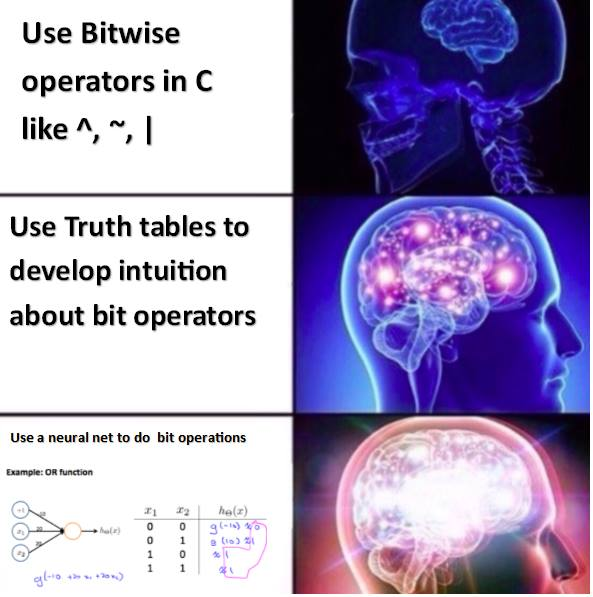
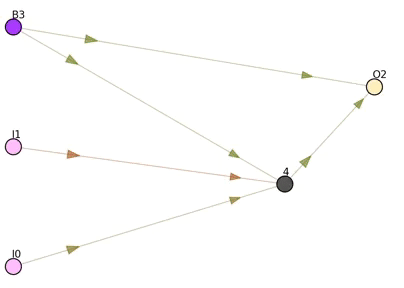
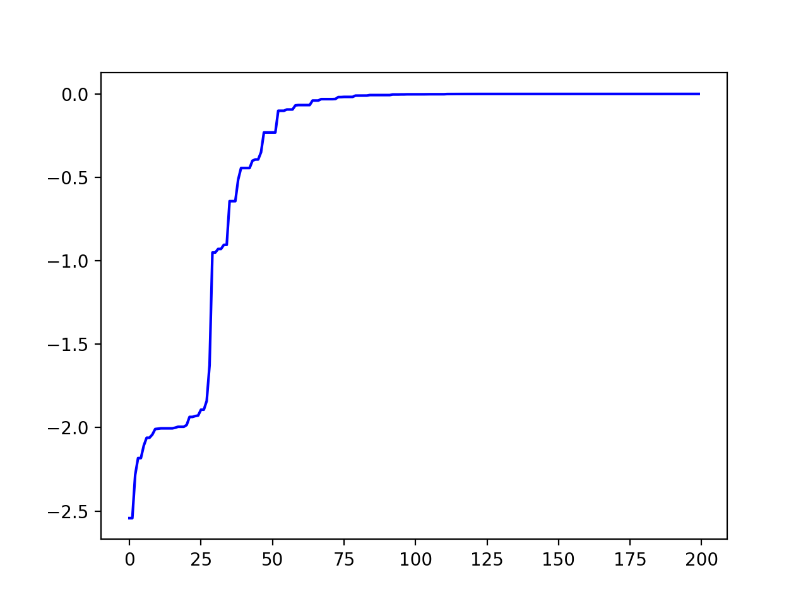

### Logic gates with Neural Nets evolved with Genetic Algorithms

  meme</img>

#### Evolution of the neural net

  gif</img>

The network has 2 inputs (I), 1 bias (B), 1 output (O) with sigmoid, and only one hidden neuron with Gaussian activation. This network solves the XOR logic gate.

#### Fitness

  fitness</img>

#### Technical notes
To continuously update the network graph, I use sockets to communicate with my Python program (which draws the graph).
